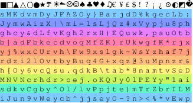

# passwordcard

A simple passwordcard generator, producing a SVG with random strings that can be used as passwords.
The clue being that each line is colored differently and there are several different glyphs in the header row, 
which makes remembering individual passwords as easy as finding easy.
So instead of remembering a 8 or 12 letter combination, you just need to remember one glyph, one
color (and the length of your password).

This project was heavily inspired by http://www.passwordcard.org. However that tool lacked several
features, such as the possibility to include existing user-provided passwords. Therefore I created
my own passwordcard generator...

## Example output and usage:

You can also use your own (existing) passwords.
This will create a passwordcard and put the password 'mySecr33t in row 3, column 5 (0-based indexing):

    generate_passwordcard.py mySecr33t 2 4

Similarly, you can provide multiple (up to 10) passwords, like the following:

    generate_passwordcard.py passw0rd 0 0 4n0th3r 3 5

You can define how many lines of numbers/digits you want using the ``-n`` switch:

    generate_passwordcard.py -n 4 passw0rd 0 0 

It is also possible to re-use a given random seed by using the ``-r`` switch:

    generate_passwordcard.py -r MyRandomSeed

## Closing remarks

Passwordcards allow you to use strong passwords even without a digital password manager. Plus you
need to have a password for your password manager, right? Now, where do you store that? In a
passwordcard! They are also ideal as fallback solution for your most important passwords - print the
passwordcard and put it in your wallet.

However, keep in mind that there is a security/usability tradeoff here: passwordcards make it easier
to use strong passwords, but they reduce security as an attacker who manages to find/steal your
passwordcard, will have to bruteforce scan significantly less passwords...

Also, please make sure to use passwords that have high entropy, otherwise anybody can spot them in
the random background (see example pictures above: you can easily spot the word 'passw0rd'...
